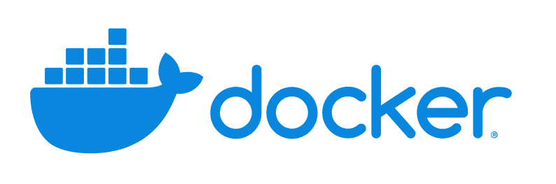
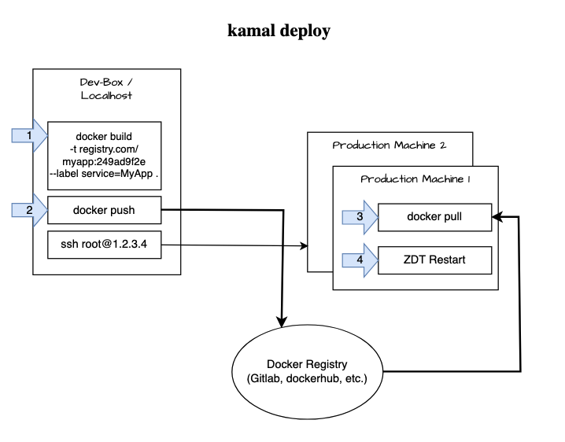
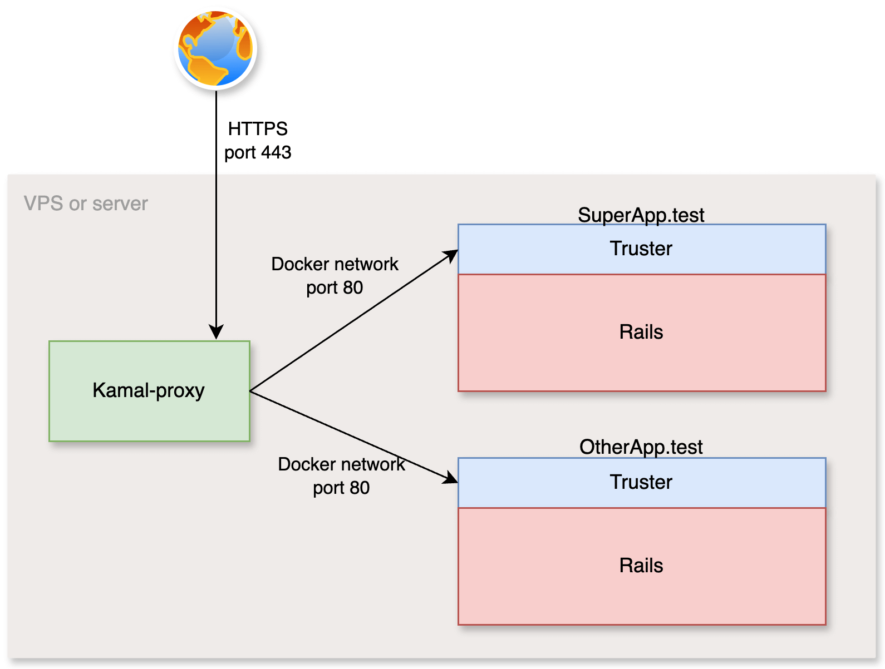
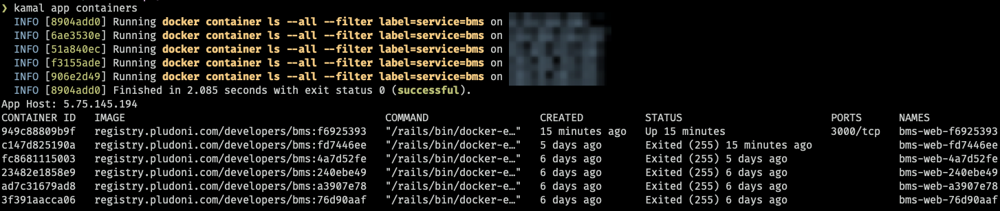

<!-- .slide: data-background="#1A53aE"  -->

# Kamal<sup>2</sup>
Stefan Wienert - Ruby Frankfurt

Empfehlungsbund.de / pludoni GmbH

2025-04-23

---

<!-- .slide: data-background="#1A53aE"   --->


## Topics

1. Deployment
3. Kamal & Basic Example
4. Rails Dockerfile
4. Details<br>
    <small>kamal-proxy & thruster<br>Integration with CI/CD<br> Migrations<br> Rollback<br> Secrets<br> Accessories<br> BG-Jobs/Cronjobs </small>

---

**Web Software Deployment**: 

Bringing the latest version of my app (with all it's dependencies) "live", reproducibly!

----

##### Running tasks in order: 
1. Installing system requirements <small>(Ruby, Node, Lib*)</small>
2. Check out Git
3. `bundle install`
4. Building assets
5. Running migrations
6. Restarting app server (atomically, ZDT) & background-job workers
7. Health Checks/Blue-Green Deployment
8. if App Server N > 1, do it again <small>(or in parallel)</small>

----

**Traditional deployment**: <br>Capistrano, Ansistrano (Ansible), Mina etc.

<ul>
<li> Sophisticated Bash wrappers
<li class='fragment'> Scaling issues/waste: <br><small>if running N>1 app-servers, most tasks (bundle install, assets) are run over and over again</small>
<li class='fragment'> Work with Stateful servers <br><small> After a couple of deployments state usually emerges, esp. when N>1 </small>
<li class='fragment'> What about maintenance:<br><small>Server restart? <br>Linux Kernel &amp;  Distribution updates?<br> Ruby upgrades? etc.</small> 
</ul>

----



### Enter Docker

<ul class='custom-ul'>
<li class='done'> Dependencies are part of the Docker Image<br><small>Ruby, system libraries, Bundled Gems, Node etc.</small>
<li class='done'> Reproducible and efficient deployment <br><small>when deploying in parallel on multiple app-servers</small>
<li class='done'> "dumb" App servers just run the Docker image 
</ul>

----

#### Docker - very quick overview

- Containers vs. VMs: <small>Docker uses containers, which share the host OS kernel, unlike virtual machines that require a full OS per instance. This makes containers much more lightweight.</small>
- <!-- .element: class="fragment" -->Based on Linux namespaces and cgroups: <small>Linux namespaces for isolation (e.g. network, process, file system) and control groups (cgroups) to limit resources like CPU and memory.</small> 
- <!-- .element: class="fragment" -->Images vs. Containers: <small>A Docker image is a snapshot of a filesystem and app configuration (like a blueprint), while a container is a running instance of that image — isolated, but lightweight and ephemeral.</small>
- <!-- .element: class="fragment" -->OverlayFS/UnionFS: <small>images use layered file systems -> like Git. Allows efficient rebuilts</small>

----

### Docker - Orchestration

Great! Now how do we:
<ul class='custom-ul'>
<li class='open-issue'>  Deploy more than 1 App-Server
<li class='open-issue fragment'>  Deploy new versions without downtime
<li class='open-issue fragment'>  Provide secrets/environment variables
<li class='open-issue fragment'>  Specify and run external service dependencies, such as Database, Redis
<li class='open-issue fragment'>  Attach persistent state/volumes 
</ul>

----

### <small>Simple Solution:</small><br> Docker-compose

<p><small>Allows to:</small></p>

<ul class='custom-ul'>
<li class="done fragment">  Provide secrets/environment variables
<li class="done fragment">   specify external service dependencies, such as Database, Redis
<li class="done fragment">   specify state/volumes 
<li class="open-issue fragment"> More than 1 App-Server
<li class="open-issue fragment"> Deploying new versions without downtime
</ul>


----

###### Enter Kamal (former "Mrsk")


> Kamal offers **zero-downtime deploys**, rolling restarts, asset bridging, remote builds, accessory service management, and everything else you need to deploy and manage your web app in production with Docker. Originally built for Rails apps, Kamal will work with any type of web app that can be containerized.
> <br>[kamal-deploy.org](https://kamal-deploy.org)

----

### Requirements:

- Docker on your local machine<small>(or build by CI/remotely)</small>
- SSH root access to (at least 1) Linux box where you want to deploy to
- (A DNS Domain Name that resolves to the box)
- A Docker registry!<!-- .element: class="fragment" -->
    - dockerhub - 1 repo free
    - gitlab.com - ♾️ free<small>max. number of tags & build minutes</small>
    - Generate Access Token and login<br>`docker login registry.gitlab.com`

----

<!-- .slide: data-slide="small-list" -->

### Installation 

- ``kamal init``<br><small>Rails 8 newly generated app.</small>
- If upgrading from an older app:<!-- .element: class="fragment" -->
  - ``bundle add kamal``<br><small>Already in Gemfile in Rails 8</small>
  - ``Dockerfile`` + ``.dockerignore``
  - ``get "/up"`` <br><small>Healthcheck Endpoint</small>
  - ``config.assume_ssl = true`` <small>config/environments/production.rb</small>


<div class='fragment'>

<a class='button href-content block center' href='https://railsbytes.com/templates/Vp7s41' style='display: block; margin-top: 15px'>
🧠 Railsbyte template from me: 
<pre><code>rails app:template LOCATION='https://railsbytes.com/script/Vp7s41'</code></pre>
</a>

</div>

----

## Example

- kelsterbach-spielt.de<br><small>Boardgame Community Site</small>
- SolidQueue, SolidCache, Importmaps, Sqlite3
- Single (shared) machine

----

<!-- .slide: data-background="#1A53aE" data-slide="code" -->


```yaml [2-3|5-8|9-13|15-19|21-28|30-32|34-35]
# config/deploy.yml
service: kbs
image: zealot128/kelsterbach-spielt

servers:
  web:
    - 1.2.3.4

proxy:
  ssl: true # auto letsencrypt
  hosts:
    - kelsterbach-spielt.de
    - www.kelsterbach-spielt.de
  
registry:
  server: registry.gitlab.com
  username: <%= ENV['CI_REGISTRY_USER'] || 'zealot128' %>
  password:
    - KAMAL_REGISTRY_PASSWORD
    
env:
  clear:
    DATABASE_URL: "sqlite3:///rails/storage/db/development.sqlite3"
    RAILS_SERVE_STATIC_FILES: "true"
    RAILS_LOG_TO_STDOUT: "true"
    RAILS_ENV: production
  secret:
    - RAILS_MASTER_KEY

volumes:
  #  Sqlite3 in storage in Rails 8.
  - "storage:/rails/storage"

builder:
  arch: amd64
  
  
  
  
```

----




----

<!-- .slide: data-slide="small-list" -->


##### In Detail

<small>Running `kamal deploy` will:</small>

1. Build image locally ``docker build .`` and push to the registry
2.  <!-- .element: class="fragment" --> Install docker on remote machine if necessary
3. Push <strong>secrets</strong> from <code>.kamal/secrets</code>  <!-- .element: class="fragment" --> 
4.  <!-- .element: class="fragment" --> Authenticates production box via Registry Token & pull image from Registry
5. Rolling restart:   <!-- .element: class="fragment" -->
    - boot one container, try to access /up until it get's a 200
    - Zero-Downtime restart container one after the other
8. Clean up old containers & images  <!-- .element: class="fragment" -->

----

### Dockerfile

<a class='button href-content inline-block' href='https://www.youtube.com/watch?v=j80I0yyx0w4'>
Inside the default Dockerfile | Rails 8 Unpacked
</a>

Quick Overview over default Rails 8 Dockerfile →

----

<!-- .slide: data-background="#1A53aE" data-slide="code" -->

```Dockerfile [1-2|4-8|10-13|15-16|18-21|23-27|29-30|32-33|35-36|38-39|2|38-39|41-43|45-48|49|51-52|54-56]
ARG RUBY_VERSION=3.3.5
FROM docker.io/library/ruby:$RUBY_VERSION-slim AS base

WORKDIR /rails

RUN apt-get update -qq && \
    apt-get install --no-install-recommends -y curl libjemalloc2 libvips sqlite3 libyaml-dev && \
    rm -rf /var/lib/apt/lists /var/cache/apt/archives

ENV RAILS_ENV="production" \
    BUNDLE_DEPLOYMENT="1" \
    BUNDLE_PATH="/usr/local/bundle" \
    BUNDLE_WITHOUT="development"

# Throw-away build stage to reduce size of final image
FROM base AS build

# Install packages needed to build gems
RUN apt-get update -qq && \
    apt-get install --no-install-recommends -y build-essential git pkg-config && \
    rm -rf /var/lib/apt/lists /var/cache/apt/archives

# Install application gems
COPY Gemfile Gemfile.lock ./
RUN bundle install && \
    rm -rf ~/.bundle/ "${BUNDLE_PATH}"/ruby/*/cache "${BUNDLE_PATH}"/ruby/*/bundler/gems/*/.git && \
    bundle exec bootsnap precompile --gemfile

# Copy application code
COPY . .

# Precompile bootsnap code for faster boot times
RUN bundle exec bootsnap precompile app/ lib/

# Precompiling assets for production without requiring secret RAILS_MASTER_KEY
RUN SECRET_KEY_BASE_DUMMY=1 ./bin/rails assets:precompile

# Final stage for app image
FROM base

# Copy built artifacts: gems, application
COPY --from=build "${BUNDLE_PATH}" "${BUNDLE_PATH}"
COPY --from=build /rails /rails

# Run and own only the runtime files as a non-root user for security
RUN groupadd --system --gid 1000 rails && \
    useradd rails --uid 1000 --gid 1000 --create-home --shell /bin/bash && \
    chown -R rails:rails db log storage tmp
USER 1000:1000

# Entrypoint prepares the database.
ENTRYPOINT ["/rails/bin/docker-entrypoint"]

# Start server via Thruster by default, this can be overwritten at runtime
EXPOSE 80
CMD ["./bin/thrust", "./bin/rails", "server"]
```

----

#### kamal-proxy & thruster

<small>Both are Go-based HTTP proxies written by 37signals.</small>

<div class='sideBySide'>
<div class='fragment'>
    
    
**Thruster:** 
- Runs inside Docker container
- Has access to your assets and/or storage and offloads file downloads via `X-Sendfile`-Header

</div><div class='fragment'>
        
**Kamal-proxy:**
    
- Runs on the Docker-Host, 
- Performs ZDTD, Letsencrypt, 
- Routes between multiple Apps on one shared machine

</div></div>

----

<!-- .slide: data-background="#1A53aE" data-slide="image" -->


<small style='font-size: 0.6rem'><a href="https://testdouble.com/insights/thruster-vs-kamal-proxy-guide">Source: TestDouble Blog</a></small>



----

#### Integration in CI-CD

*Don't want to crap your local laptop or integrate into CI release?*

Built the image in a CI-Step:

```bash [1-3|4]
docker build --pull -t $CI_REGISTRY_IMAGE:$CI_COMMIT_SHA \
    --cache-from $CI_REGISTRY_IMAGE:latest \
    --label service=kbs .
docker push $CI_REGISTRY_IMAGE:$CI_COMMIT_SHA
```

<div class='fragment center'>
And deploy when ready:

```bash
kamal deploy --skip-push --version=$CI_COMMIT_SHA
```
    
</div>
<div class='fragment info-alert'>
<small> Build process can start immediately in parallel to testing and so deployment afterwards is very quick!</small>
</div>

----

#### rails console?

<!-- .slide: data-slide="code" -->

Kamal aliases:

```yaml
aliases:
  console: app exec --interactive --reuse "bin/rails console"
  shell: app exec --interactive --reuse "bash"
  tail: app logs -f
  dbc: app exec --interactive --reuse "bin/rails dbconsole --include-password"
  deploy-lastest: "deploy -P --version=<%= `git log  | head -n 1 | awk '{ print  $2 }'`%>"
```

----

#### Migrations

<!-- .slide: data-slide="code" -->


By default, migrations are run by the Rails 8 ``./bin/docker-entrypoint``

```bash [10-13]
#!/bin/bash -e
#bin/docker-entrypoint

# Enable jemalloc for reduced memory usage and latency.
if [ -z "${LD_PRELOAD+x}" ]; then
    LD_PRELOAD=$(find /usr/lib -name libjemalloc.so.2 -print -quit)
    export LD_PRELOAD
fi

# If running the rails server then create or migrate existing database
if [ "${@: -2:1}" == "./bin/rails" ] && [ "${@: -1:1}" == "server" ]; then
  ./bin/rails db:prepare
fi

exec "${@}"
```

----

### ℹ️ IMPORTANT

Make sure, the migrations are quick, otherwise, the health check will kill the process.

<div class='fragment center'>
<small>Default is 7 tries each 1 second wait only!</small>

```yaml
proxy:
  healthcheck:
    interval: 2s
    max_attempts: 10
```

<a class='button href-content inline-block fragment center' href='https://github.com/ankane/strong_migrations'>
💡 👉 <code>strong_migrations</code>
</a>

</div>

----

### Rollback

```bash
# get latest deployed release id 
kamal app containers
```



<div class='fragment center'>
Rollback = Deploy without build & download

```bash
kamal rollback fd7446ee
```

</div>


----

### Secrets 

<!-- .slide: data-slide="code" -->

- Use `config/credentials/production.yml.enc`, and 
- only provide `RAILS_MASTER_KEY` environment variable via ``.kamal/secrets``.

<div class='fragment' style='margin-top: 10px'>
    
```bash [1-3|5-6|8-10]
# 1.) set directly (don't check-in this file then, but provide on the deploying host)
KAMAL_REGISTRY_PASSWORD=glpat-123123123123123
RAILS_MASTER_KEY=abcabc123abc123abc123abc123

# 2.) or allowlist from Environment Variables
KAMAL_REGISTRY_PASSWORD=$KAMAL_REGISTRY_PASSWORD

# 3.) or ask OS password manager / adapter (1Pass, Bitwarden, LastPass etc.)
SECRETS=$(kamal secrets fetch --adapter 1password --account my-account --from MyVault/MyItem KAMAL_REGISTRY_PASSWORD)
KAMAL_REGISTRY_PASSWORD=$(kamal secrets extract KAMAL_REGISTRY_PASSWORD $SECRETS)
    
    


```
    
</div>

----

##### Accessories

<p style='margin-bottom: 0px'><small>Services, independent of code deployments: Database, Redis.</small></p>

<!-- .slide: data-slide="code" -->


```yaml [3|4-11|13-18|20-39|40-48]
service: example
# [..]
accessories:
  db:
    image: "postgres:16"
    hosts:
      - 1.2.3.4
    directories:
      - data:/var/lib/postgresql/data
    env:
      POSTGRES_HOST_AUTH_METHOD: trust
      
  redis:
    image: redis:7.0
    hosts:
      - 1.2.3.4
    directories:
      - redis_data:/data
      
  db_backup:
    image: eeshugerman/postgres-backup-s3:12
    hosts:
      - 1.2.3.4
    env:
      secret:
        - S3_REGION
        - S3_ACCESS_KEY_ID
        - S3_SECRET_ACCESS_KEY
        - S3_BUCKET
        - S3_ENDPOINT
      clear:
        SCHEDULE: '@daily'
        S3_PREFIX: example/db
        BACKUP_KEEP_DAYS: 7
        POSTGRES_HOST: example-db
        POSTGRES_DATABASE: example_production
        POSTGRES_USER: postgres
        POSTGRES_PASSWORD: "none"
        
env:
  clear:
    DATABASE_URL: "postgres://postgres@example-db:5432/example_production"
    REDIS_URL: "redis://example-redis:6379/0"
    RAILS_SERVE_STATIC_FILES: "true"
    RAILS_LOG_TO_STDOUT: "true"
    RAILS_ENV: production
  secret:
    - RAILS_MASTER_KEY

servers: 
  web:  ...
  jobs: ...


```

----

#### Shared host: multiple apps on one machine

- Kamal-Proxy does the routing based on the host name. No further config required.
- Just make sure the ``service: example`` name is unique for each app.
-  <!-- .element: class="fragment" --> Prefix all Storage and Cache paths with the service name, otherwise, you might share the storage between apps.
-  <!-- .element: class="fragment" --> You can also have multiple Accessories (like PostgreSQL) of the same kind. The hostname is unique example-db, so no port clashes.

----

<!-- .slide: data-slide="code" -->

#### BG-Jobs & Cronjobs

```yaml [5-12|13-18]
servers:
  web:
    - 10.0.0.15
    - 10.0.0.16
  job:
    hosts:
      - 10.0.0.17
      - 10.0.0.18
    # depends on your Job Queue:
    cmd: bundle exec sidekiq -C config/sidekiq.yml
    cmd: ./bin/jobs
    cmd: bundle exec good_job start
  cron:
    hosts:
      - 1.2.3.4
    cmd:
      bash -c "(env && cat config/crontab) | crontab - && cron -f"
      


```

<div class='fragment info-alert'>
<small> Don't use cron like this. Jobs are killed during deployment and not tried again. Better use a job-queue with Cron feature.</small>
</div>

----

#### Asset Bridging

- If you build assets (Vite, Sprockets etc), the asset fingerprints will change. 
-  <!-- .element: class="fragment" --> Browser loads html file from old deployment, then proceed to load assets with old fingerprints.
- <!-- .element: class="fragment" --> Meanwhile, new deployment is put live, old asset is not available anymore.
- <!-- .element: class="fragment" -->Solution: asset bridging

```yaml
# asset_path: /rails/public/vite
asset_path: /rails/public/assets
```
<!-- .element: class="fragment" -->

----

<div class='sideBySide'>
<div>

**Summary**
    
- Kamal 1 was incomplete, Kamal 2 works great.
- <!-- .element: class="fragment" -->Works especially well for small apps on a shared host for small money
- <!-- .element: class="fragment" -->...but also for larger apps.
- <!-- .element: class="fragment" -->Thin wrapper around Docker, no Magic. <br>Docker-Compose++

</div>
<div class='fragment center'>
    
**Check this, too:**

- Monitoring, Log-Aggregation, Error Tracking (AppSignal, Sentry etc.)
- <!-- .element: class="fragment" -->Backup
- <!-- .element: class="fragment" -->Data-Storage (S3 etc.)
- <!-- .element: class="fragment" -->Failover Database
- <!-- .element: class="fragment" -->CDN, Bot-Protection

</div></div>

----


###### Resources:


<div style='display: flex; flex-direction: column; gap: 10px'>
<a class='button href-content' href='https://www.youtube.com/@railsofficial'>Docker + Kamal</a>
<a class='button href-content' href='https://kamal-deploy.org/'>Video by DHH & Docs</a>
<a class='button href-content' href='https://strzibny.gumroad.com/l/kamalbook'>kamalbook by Joset Strzibny</a>
<a class='button href-content' href='https://testdouble.com/insights/thruster-vs-kamal-proxy-guide'>Thruster vs. Kamal Proxy</a> 
</div>

<div style='padding: 30px 0 10px 0; text-transform: uppercase; font-size: 0.4em; color: #999;'>Connect with me:</div>
<div class='flex' style='font-size: 0.6em;  gap: 15px; justify-content: center'>
<a href='https://ruby.social/@zealot128' class='button href-content'>
<br> @zealot128@ruby.social</a>
<a class='button href-content' href='https://www.stefanwienert.de'>
    <br>
    stefanwienert.de</a>
<a class='button href-content' href='https://www.linkedin.com/in/stefanwienert/'>
    <br>
    /in/stefanwienert</a>
<a class='button href-content' href='https://www.empfehlungsbund.de/jobs'>
    <br>
    Jobs</a>
</div>

